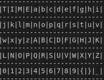

# Momma says to play fair

## Description

> Hello C-Team,
>
> We received an encrypted message from deep space. We think that someone is trying to smuggle a flag away from Omni-Flags. Decrypt the following message to get us one step closer to success:
>
> Here is the message: nEctTfwcH8P08nv4w{K0jT3Zn2K2A88k{Y
>
> Good luck, HQ

## Not Fair >:(

We are given a key table

<figure><figcaption><p>TIME</p></figcaption></figure>

Also encoding code, which I have added annotations with ###

```python
#!usr/bin/python3
import string
import re

#This is not the flag, you have to decrypt the cipher to get your flag.
m="magpieCTF{flag_redacted}"

### ext = ABC...XYZabc...xyz{}_ and key = TIME
print("Time is the key!\n")
ext=string.ascii_letters+string.digits+"{}_"
key="TIME"

# Taking out the characters in key
### Remove letters TIME from ext
for chr in key:
    ext=ext.replace(chr,"")

# key table is compost of key, alphabets, digits from 0 to 9 and {}_
key+=ext

# Print out the key table
### This results in the key table picture
count=1
print("-"*27)
for c in key:
    if(count%13==1):
        print("|",end="")
    print(c+"|",end="")
    if(count%13==0):
        print("\n"+"-"*27)
    count+=1

# break the key down into groups of 13
### Each row in the key table
key=re.findall('.'*13,key)


def encrypt(key,m):
    #Append X in between if two adjacent letters are the same
    count=0
    while(count<len(m)-1):
        if(m[count]==m[count+1]):
            m=m[:count+1]+"X"+m[count+1:]
            count+=1
        count+=1

    #Append X at the end if the message does not have even amount of letters
    if(len(m)%2!=0):
        m+="X"

    #Breaking the message down into pairs
    m=re.findall('.'*2,m)
    
    #Creating cipher
    c=""
    for p in m: ### For pair of letters in the message
        ### Get the coordinates of each letter in the table
        p0Index=(-1,-1)
        p1Index=(-1,-1)
        for x in range(len(key)):
            for y in range(len(key[0])):
                if key[x][y]==p[0]:
                    p0Index=(x,y)
                if key[x][y]==p[1]:
                    p1Index=(x,y)
        
        # if they are on the same row, append the character on its right to the cipher
        if p0Index[0]==p1Index[0]:
            if(p0Index[1]!=len(key[0])-1):
                c+=key[p0Index[0]][p0Index[1]+1]
            else:
                c+=key[p0Index[0]][0]

            if(p1Index[1]!=len(key[0])-1):
                c+=key[p1Index[0]][p1Index[1]+1]
            else:
                c+=key[p1Index[0]][0]

        # if they are on the same column, append the character below to the cipher
        elif p0Index[1]==p1Index[1]:
            if(p0Index[0]!=len(key)-1):
                c+=key[p0Index[0]+1][p0Index[1]]
            else:
                c+=key[0][p0Index[1]]

            if(p1Index[0]!=len(key)-1):
                c+=key[p1Index[0]+1][p1Index[1]]
            else:
                c+=key[0][p1Index[1]]

        # if they are not on the same row or column, copy the letter in the coloum of the other letter in the same row to the cipher
        else:
            c+=key[p0Index[0]][p1Index[1]]+key[p1Index[0]][p0Index[1]]

    return(c)


    
c=encrypt(key,m)
print("cipher: "+c)

```

To decrypt, we must do the reverse of the encryption purpose by considering every pair of characters in the ciphertext

1. If the two letters are not in the same row or column, shift them to the letter that's the same column of the other, while keeping the same row
2. If the two letters are in the same column, shift them to the letter that's one row up
3. If the two letters are in the same row, shift them to the letter that's one column to the left
4. Remove any dummy "X"s that were added in, either at the end or between two same letters

Code can be written to do this, however I did it manually

## Flag

`magpieCTF{L34rn_H0w_T0_Pl4y_F41r}`
