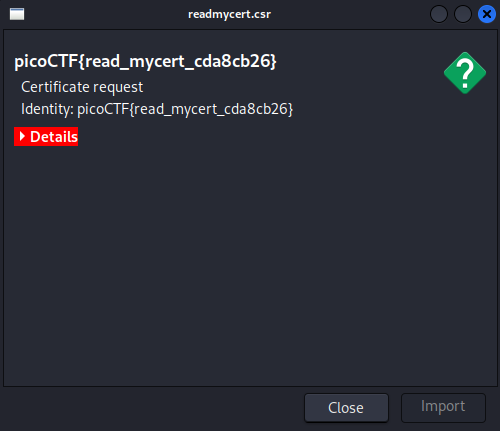

# ReadMyCert

## Description

> How about we take you on an adventure on exploring certificate signing requests
>
> Take a look at this CSR file [here](https://artifacts.picoctf.net/c/422/readmycert.csr).

## Hints

1

Download the certificate signing request and try to read it.

## Read It

Download `readmycert.csr` and open it

<figure><figcaption>
Well that was easy
</figcaption></figure>

## Flag

`picoCTF{read_mycert_cda8cb26}`
