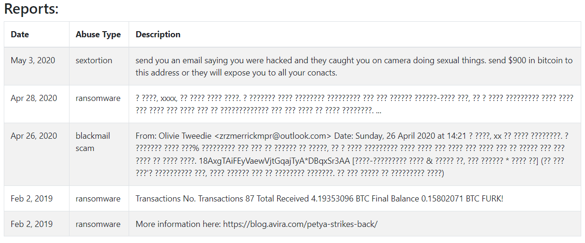

# 🏁 UW CTF S22

Fun jeopardy-style capture the flag hosted by the [University of Waterloo's CTF club](https://ctf.uwaterloo.ca/)

Since I am a noob I partook in the noob division :sunglasses:

<figure><figcaption>
Tied for first
</figcaption></figure>

<figure><figcaption>
Stats
</figcaption></figure>

| Challenges | Points | Solves |
| ---------- | ------ | ------ |
|            |        |        |
|            |        |        |
|            |        |        |
