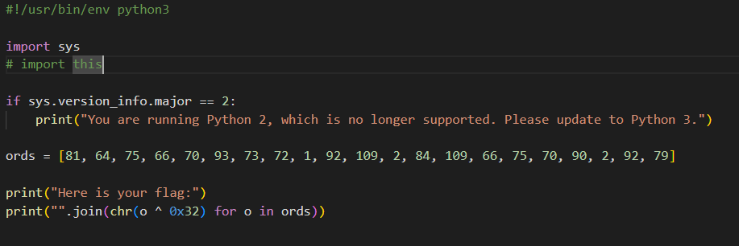

# Google Form

## Description

> [https://docs.google.com/forms/d/e/1FAIpQLSdlb7jVOYFyUqv683XsVW5QAEHw-MtyjPNIx9C5SUBI22Q/viewform](https://docs.google.com/forms/d/e/1FAIpQLSdlb7jVOYFyUqv683XsVW5QAEHw-MtyjPNIx9C5SUBI22Q/viewform)

## Da Goog

The link brings us to a Google form with one question: `Get this question right to get to the flag!`

<figure><figcaption>
Unfortunately, it won't be this easy...
</figcaption></figure>

The hint tells us to try to inspect element, so let's give that a go

Start with `CTRL-F` "flag" and we eventually find this juicy bit in the Elements tab

<figure><figcaption></figcaption></figure>

Fun fact: Inputting this flag into the form input is still incorrect!

## Flag

`uwctf{c1i3nt_51d3_v41id4ti0n_a9d807f09b82c404}`
