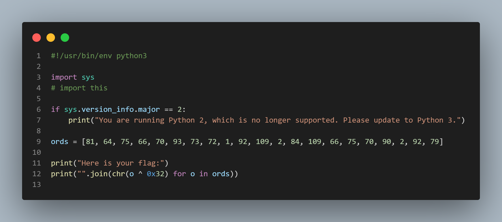

# Great Snakes

## Description

> Modern cryptography involves code, and code involves coding. CryptoHack provides a good opportunity to sharpen your skills.\
> \
> Of all modern programming languages, Python 3 stands out as ideal for quickly writing cryptographic scripts and attacks. For more information about why we think Python is so great for this, please see the [FAQ](https://cryptohack.org/faq#python3).\
> \
> Run the attached Python script and it will output your flag.\
> \
> Challenge files:\
> &#x20; \- [great\_snakes.py](https://cryptohack.org/static/challenges/great\_snakes\_35381fca29d68d8f3f25c9fa0a9026fb.py)\
> \
> Resources:\
> &#x20; \- [Downloading Python](https://wiki.python.org/moin/BeginnersGuide/Download)

## Sssssssssnakes

Run the python script with `python great_snakes.py` to get the flag

* Note that you need Python 3

<figure><figcaption>
Slithering code
</figcaption></figure>

## Flag

`crypto{z3n_0f_pyth0n}`
